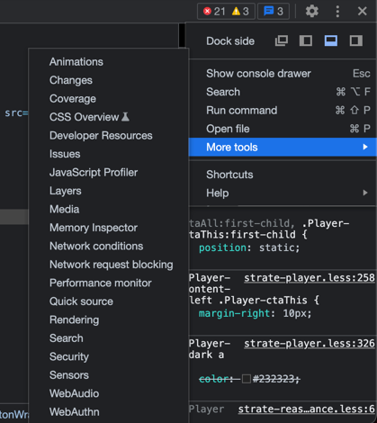

# 1. Impacts environnementaux du numérique
Workshop autour des impacts du numérique.
Avec un focus sur les impacts environnementaux pour cette première partie.

L'objectif en sortie de cette atelier : en tant qu'ingénieur, vous positionner et maîtriser les ordres de grandeurs des impacts environnementaux du numérique.

Le but est de travailler par itérations, comme dans un contexte professionnel.

# 📓 Maîtrise du sujet

## MOOC de l'INR
**⏱ 1 heure**

Suivez le mooc de l'INR à cette adresse : https://www.academie-nr.org/sensibilisation

Esprit de synthèse :
- Prenez des notes de ce qui vous marque (chiffres, phrases clefs etc...).
- Vous pouvez dessiner, faire des schémas, du sketchnoting.
- Structurez un pitch pour la promotion d'un numérique plus responsable à partir de vos observations.
- No slide : structurez votre discours sur le modèle de pitch [start with why](https://youtu.be/u4ZoJKF_VuA?t=125).

## Consolidation
**⏱ 15 minutes**

👋 Formez des groupes de 3 personnes.

- Partagez vos notes et consolidez un pitch.
- Répartissez-vous le temps de parole.

Le but : en entreprise, vous aurez à vous exprimer sur le sujet, plus vous prenez le temps d'en parler, plus vous intégrer le vocabulaire et serez à l'aise.

## Restitution
**⏱ 15 minutes**

3 groupes seront sélectionnés pour convaincre leur promo de l'intérêt de pousser une démarche numérique responsable en entreprise.
Les autres seront amenés à noter de 👍1 à 🖐5 leur prestation sur les deux critères :
- Impact des arguments (le fond)
- Capacité de persuasion / conviction (la forme)

# ⏸ Pause

# 🔥 Architecture pour un numérique soutenable

Vous allez réaliser un atelier d'**🔥Xtreme Tech watch**.

Il s'agit d'un atelier **d'intelligence collective** vous permettant de capter rapidement de l'information sur des sujets tech variés et en très peu de temps.
> Plus d'info sur le site [speaker deck de Yoan Thirion](https://speakerdeck.com/thirion/xtrem-tech-watch-9997c945-5122-462b-9e18-6913ef56a112?slide=3)

## Les sujets

### 1. Virtualisation et containerisation des infrastructures
Quelles ont été l'évolution des technologies de virtualisation des serveurs et qu'apporte la containerisation ?

### 2. Serverless Architecture
C'est quoi le `serverless` et en quoi ça consomme moins de ressources / d'énergie ?

### 3. JAMStack Architecture
Vous avez dit `JAMStack` ? C'est quoi et quels sont les avantages d'un point de vue environnemental ?

### 4. GraphQL API
`GraphQL` c'est quoi ? Et par rapport aux API `REST` ? En quoi c'est mieux pour la planète ?

### 5. Micro-services
Pourquoi faire des `Micro-services` au lieu d'un monolithe applicatif ?

### 6. Islands Architecture
Qu'est ce que le concept de micro-frontend ou encore les `Islands Architecture` ?

### 7. Progressive Web Apps
C'est quoi les `PWA` (Progressive Web Apps) ? Pourquoi c'est plus inclusif qu'une application mobile ?

## Faites votre choix en solo
**⏱ 5 minute**

Expliquez-nous votre choix et constituer les équipes

## Recherche en solo
**⏱ 15 minutes**

C'est parti pour quelques minutes de recherche sur le sujet.

**⚠️ Pensez à prendre des notes.**

## Combinez vos recherches
**⏱ 15 minutes**

Discutez-en avec les autres participants ayant choisi le même sujet que vous.

Identifiez les interrogations restantes et les parties du sujet qui restent à creuser.

## Retour en exploration
**⏱ 15 minutes**

Explorez les dernières interrogations et zones d'ombres.

Synthétisez vos découvertes de manière a pouvoir les présenter au groupe.

## Restitution
**⏱ 30 minutes**

Chaque équipe parle du sujet au reste du groupe.

C'est le moment de partager vos **découvertes** mais aussi vos **incompréhensions**.

# ⏸ Pause

# 🎯 La mesure
Nous allons tester ensemble les outils de mesure disponibles sur le marché.

👋 Formez des groupes de 3 - 4 personnes.

**Choisissez un site** (ecommerce, administration, artistes ...) **sur lequel vous allez effectuer vos analyses.**

Si vous manquez d'inspiration, voici une petite liste :
- [Fnac.com](https://fnac.com)
- [Laposte.fr](https://laposte.fr)
- [Ameli.fr](https://ameli.fr)
- [CAF.fr](https://www.caf.fr)
- [Impots.gouv.fr](https://www.impots.gouv.fr)
- [Angers.fr](https://www.angers.fr/)
- [Polytech Angers](http://www.polytech-angers.fr)

## Fruggr

**⏱ 30 minutes**

Rendez-vous sur [fruggr.io](https://www.fruggr.io/).

- Ajoutez votre site aux services de votre organisation.
- Paramétrez l'analyse pour réduire le nombre de pages analysées à 50.
- Lancez l'analyse.

ℹ️ Le temps que l'analyse se termine, testez les outils suivants (chromium devtools, ecoindex)

👉 Notez les différentes améliorations que vous feriez sur les différents domaines : environnement, social, sobriété.

## Chromium Devtools
**⏱ 20 minutes**

- Ouvrez le navigateur chromium de votre choix (chrome, brave, edge ...) et lancez les devtools.
- Rendez-vous dans l'onglet `Network` et `slow 3G` dans le menu de `throttling` pour simuler le chargement avec une mauvaise connexion 3G
- Identifier le pourcentage de javascript et de css non utilisé avec l'outil `Coverage` dans `More tools`.
  
- Dans l'onglet `Lighthouse` vous trouverez un outil vous proposant un certain nombre d'indicateurs.

👉 Lancez une analyse `Lighthouse` sur le site choisi et **notez 3 points à améliorer**.

## Ecoindex

**⏱ 20 minutes**

Un outil historique et performant permettant d'obtenir rapidement une note au format "ecoscore"
comparable à celles que l'on peut trouver pour l'électroménager en France.
En complément de cette note, l'outil donne rapidement un plan d'action pour réduire l'impact d'une page web donnée.
- [Extension Chrome](https://chrome.google.com/webstore/detail/greenit-analysis/mofbfhffeklkbebfclfaiifefjflcpad)
- [Extension Firefox](https://addons.mozilla.org/fr/firefox/addon/greenit-analysis/)

Une [version web](https://www.ecoindex.fr/) est également disponible

Le projet est porté par le [Collectif Conception Numérique Responsable (cnumr)](https://collectif.greenit.fr/)

👉 Lancez une analyse sur le site choisi et **notez 3 points à améliorer**.
