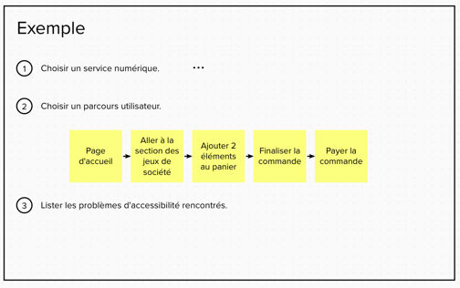

# 1. Impacts sociaux du numérique

## Introduction

Les impacts sociaux du numérique sont multiples, aussi bien positifs que négatifs :

| Positifs                 | Négatifs                                     |
|--------------------------|----------------------------------------------|
| Communication et partage | Harcèlement / isolement / fracture numérique |
| Confort de vie           | Conditionnement                              |
| Sécurisation             | Exploitation des données personnelles        |
| ...                      | ...                                          |

Pour ce workshop nous allons mettre le focus sur l'accès à l'information et la lutte contre l'exclusion des outils numériques.
Une des pistes : garantir l'accessibilité des services numériques.

Avec une question :

> Et vous, vous pourriez vivre sans Internet ?

## 🧏 Sensibilisation à l'accessibilité numérique
**⏱ 1 heure**
### Introduction
En une heure, nous ne ferons pas de vous des experts de l'accessibilité. 
Nous allons vous donner une vision d'ensemble, le vocabulaire et les ressources vous permettant d'aller plus loin.

Il s'agit d'un sujet clef trop souvent laissé de côté, donnant lieu à des aberrations que l'on peut rencontrer tous les jours en navigant sur le web.

👉 Pour commencer, 3 contenus vidéo de l'[association Valentin Haüys](https://www.avh.asso.fr/fr) de la séquence `#OnVousVoit`:
- [Qu'est-ce que l'accessibilité numérique et pourquoi c'est important ?](https://www.youtube.com/watch?v=fZo_ky7_XZ8)
- [Quatre bonnes raisons de rendre son site internet accessible](https://www.youtube.com/watch?v=cPFYtFEEW7g)
- [Trois idées reçues sur l'accessibilité numérique](https://www.youtube.com/watch?v=DO26F5oMXbc)
- [Video Introduction to Web Accessibility and W3C Standards](https://www.w3.org/WAI/videos/standards-and-benefits/)

### Plan 
1. Introduction
2. Accessibilité : de quoi parle-t-on ?
3. Vers l’accessible “by design”.
4. Les outils spécialisés.
5. Conclusion

### Le référentiel RGAA

> [Référentiel Général d'Amélioration de l'Accessibilité](https://accessibilite.numerique.gouv.fr/)

### Le guide du WAI ARIA pour le développement de composants / patterns accessible

> [ARIA Authoring Practices Guide (APG)](https://www.w3.org/WAI/ARIA/apg/patterns/)

## ⏸ Pause

## Utilisation d'un liseuse d'écran
**⏱ 30 minutes**

### Installation de NVDA

NVDA est une liseuse d'écran très utilisée qui permet aux aveugles et déficients visuels de pouvoir dicter l'écran en cours de lecture.

👉 Téléchargez et installez la liseuse d'écran NVDA
- Rendez-vous sur le site https://www.nvda-fr.org/
- Télécharger le programme d'installation
  - ⚠️ Au moment de l'installation, décochez le chargement à l'ouverture de la session.
  - Pensez à brancher votre casque audio 😄
- Une fois l'installation terminée :
  - Vous pouvez personnaliser la voix ainsi que la vitesse dans les options de NVDA.
  - Vous avez la possibilité de visualiser la lecture à l'écran et de désactiver la vocalisation.

### Exercice de navigation au clavier

> Naviguez au clavier à l'aide des touches :
> - `Tab` : Aller à l'élément focusable suivant.
> - `Maj` + `Tab` : Revenir à l'élément focusable précédent.
> - `h` : aller au titre de niveau suivant.
> - `Maj` + `h` : Revenir au titre de niveau précédent.
>
> Plus de raccourcis : [Documentation NVDA](https://www.nvda-fr.org/doc/userGuide.html#WebNavigation)

**🤝 Par groupes de 2**

👉 Choisissez un service numérique à naviguer et naviguez à la voix.
- Réalisez une première navigation et notez les éléments qui vous surprennent

👉 Effectuez une action quotidienne uniquement au clavier. 
- Par groupe de deux : 
  - Une personne aveugle, l'autre voyante.
  - Fermez les yeux ou utilisez un bandeau (on vous surveille, ne vous endormez pas 😉).
- Rendez-vous sur le service numérique de votre boîte mail.
- Rédigez un mail de test et envoyez le à votre voisin de table.

## 🕵️‍♀️ Détectez les problèmes d'accessibilité
**⏱ 1 heure**

**🤝 Par groupes de 4**

### Disclaimer
Avant tout : en matière d'accessibilité, rien ne remplace une analyse manuelle des services numériques.
Mais un petit coup de main n'est pas de refus pour les détecter lorsqu'on débute.

D'après une étude de l'entreprise `Deque` qui a créé l'outil `aXe Core`, il est possible d'automatiser 20% à 30% des règles du WCAG en niveau A et AA.
Ce n'est donc pas magique.

### Les assistants de diagnostique
Pour la suite du workshop, vous serez amenés à utiliser les outils suivants :
- Chromium devtools (lighthouse) ou Firefox devtools
- [Fruggr (score social)](https://fruggr.io)
- [aXe Core devtools](https://chrome.google.com/webstore/detail/axe-devtools-web-accessib/lhdoppojpmngadmnindnejefpokejbdd)
- [Color Contrast Checker](https://www.tpgi.com/color-contrast-checker/)

Pour vous aider à détecter les éventuels problèmes d'accessibilité, vous pouvez vous référer aux notices de l'entreprise `AcceDe Web`:
- [Les notices AcceDe Web](https://www.accede-web.com/notices/)

Pour aller plus loin dans l'analyse
- [Assistant RGAA](https://chrome.google.com/webstore/detail/assistant-rgaa/cgpmofepeeiaaljkcclfldhaalfpcand)

### Fiche d'analyse
👉 Renseignez le template d'analyse avec vos observations
- Choisissez un service numérique.
- Choisissez un parcours utilisateur que vous allez analyser.

Voici un template pour vous aider :

## ⏸ Pause

### Restitution

**⏱ 50 minutes**

👉 Présentez-nous vos résultats d'analyse par groupe.
- Présentez-nous votre parcours utilisateur vocalisé
- Dites-nous les pistes d'amélioration que vous avez détectées.
- Priorisez 3 actions à effectuer rapidement.
- Bonus : alertez le service numérique en question sur ses manquements.
